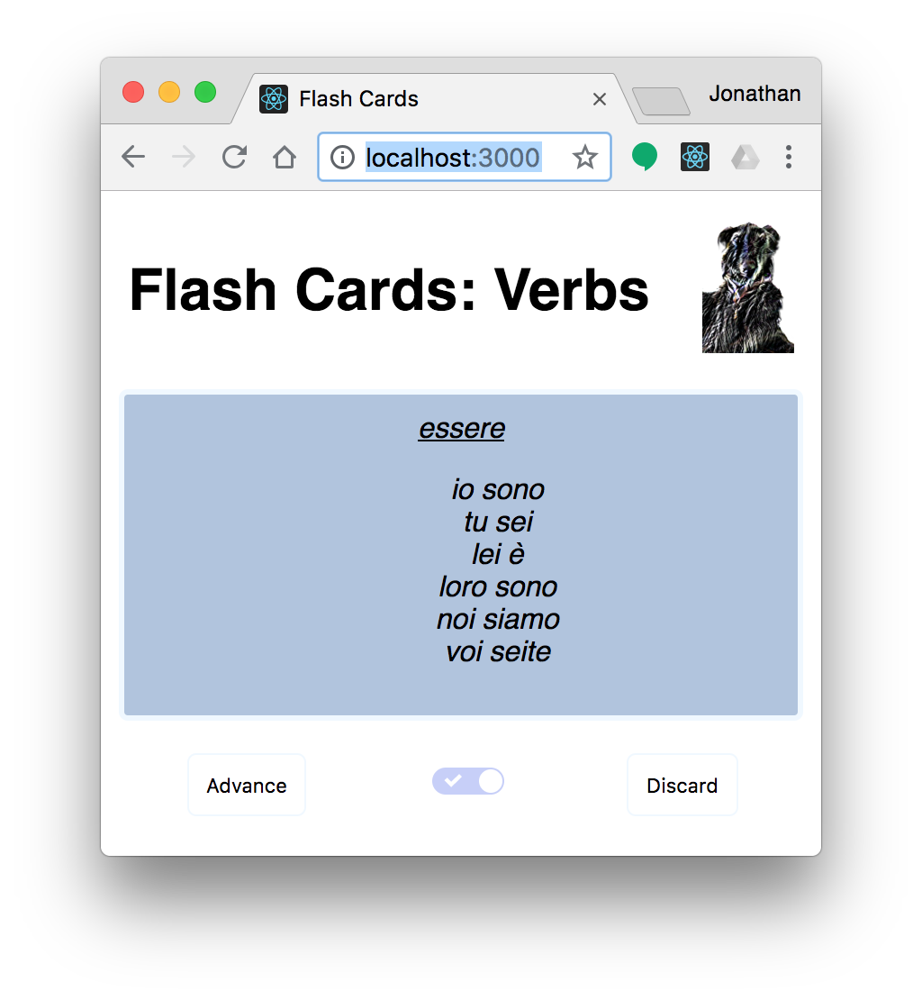

# Flash Cards
Flash Cards is web-based flash-card study aid. 

## Installation
```bash
npm run build
python -m http.server 3000 # e.g. for python 3
# point your browser at http://localhost:3000
```

Upon loading the page, you will be prompted to select a deck of cards stored in the ``public/cards`` directory.  Card decks are stored as lists of JSON objects, with each element having ``front`` and ``back`` fields. For example

```json
[ { "front": "a dog", "back": "un cane" },
  { "front": "a cat", "back": "un gatto" } ]
```

Add subdirectories and json files to suit yourself.  The card fields may contain HTML code, which can even play audio upon rendering.

```json
 { "front": "we go <audio autoplay=\"autoplay\" src=\"audio/we_go.mp3\"></audio>",
   "back": "andiamo <audio autoplay=\"autoplay\" src=\"audio/andiamo.mp3\"></audio>" }
```

## Controls


- *tap card:* Flip the card.
- *Advance:* Display the next card in the deck.
- *left/right slider:* Display the front or back of card by default.
- *discard:* Remove the card until the application is reloaded.

## Todos
- Advance/flip/discard with swipe.
